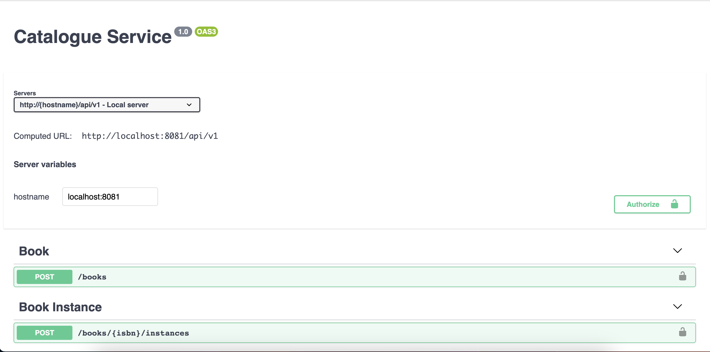
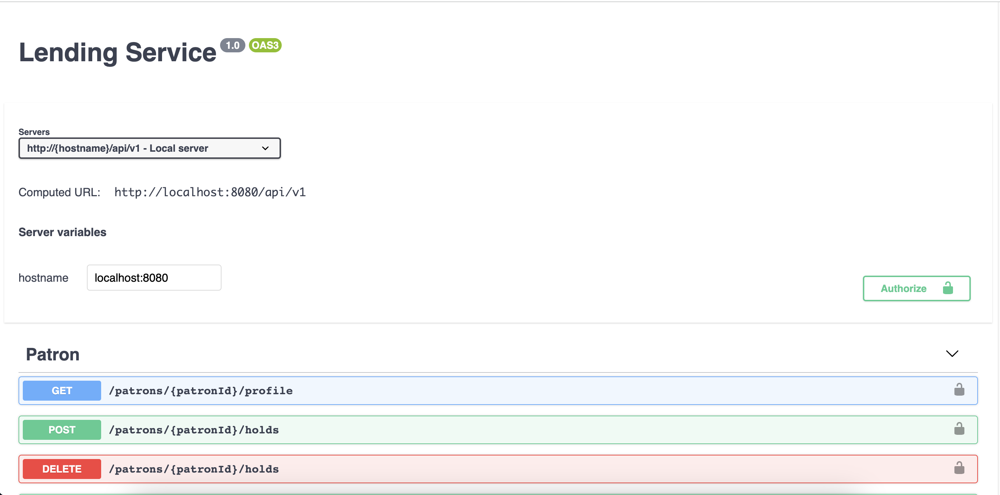

# Go DDD Library
This is an attempt to apply DDD, Clean Architecture, and CQRS with Golang.

## Domain description
The domain is borrowed from [ddd-by-examples](https://github.com/ddd-by-examples/library). Read it for more details.
> A public library allows patrons to place books on hold at its various library branches. Available books can be placed on hold only by one patron at any given point in time. 
> Books are either circulating or restricted, and can have retrieval or usage fees. A restricted book can only be held by a researcher patron. 
> A regular patron is limited to five holds at any given moment, while a researcher patron is allowed an unlimited number of holds. An open-ended book hold is active until the patron checks out the book, at which time it is completed. 
> A closed-ended book hold that is not completed within a fixed number of days after it was requested will expire. This check is done at the beginning of a day by taking a look at daily sheet with expiring holds. 
> Only a researcher patron can request an open-ended hold duration. Any patron with more than two overdue checkouts at a library branch will get a rejection if trying a hold at that same library branch. 
> A book can be checked out for up to 60 days. Check for overdue checkouts is done by taking a look at daily sheet with overdue checkouts. Patron interacts with his/her current holds, checkouts, etc. by taking a look at patron profile. Patron profile looks like a daily sheet, but the information there is limited to one patron and is not necessarily daily. 
> Currently a patron can see current holds (not canceled nor expired) and current checkouts (including overdue). Also, he/she is able to hold a book and cancel a hold.
> 
> How actually a patron knows which books are there to lend? Library has its catalogue of books where books are added together with their specific instances. 
> A specific book instance of a book can be added only if there is book with matching ISBN already in the catalogue. 
> Book must have non-empty title and price. At the time of adding an instance we decide whether it will be Circulating or Restricted. 
> This enables us to have book with same ISBN as circulated and restricted at the same time (for instance, there is a book signed by the author that we want to keep as Restricted)

### Architecture
This image is borrowed from [ddd-by-examples](https://github.com/ddd-by-examples/library). 
This may **not be correct in the details**, but it is still good to describe Bounded Contexts and the relationship between them.


## Technical stack

### Library
- [openapi](https://www.openapis.org/)
- github.com/golang-migrate/migrate
- github.com/volatiletech/sqlboiler
- [watermill](https://watermill.io/docs/)
- github.com/rs/zerolog

### Infrastructure
- PostgresDB
- Kafka

## Project layout
The project layout is heavy inspired from [Wild Workouts](https://github.com/ThreeDotsLabs/wild-workouts-go-ddd-example) of [Three Dots Labs](https://threedots.tech/).
```shell
.
├── api                     # API definations
│   └── openapi                
├── docs
│   └── images
├── internal                # Application Codes
│   ├── catalogue               # Catalogue service
│   │   └── models
│   ├── common                  # Some common code used for both services
│   └── lending                 # Lending service (follow hexagonal architecture)
│       ├── adapters                # Adapaters, where we connect to DB, external services
│       │   └── models
│       ├── app                     # Application layer
│       │   ├── command
│       │   └── query
│       ├── domain                  # Domain, where business logic lives
│       ├── ports                   # Ports, where other services connect to our service (http, grpc, kafka,..)
│       └── service                 # Initialize and wire anything up
├── migrations              # Migration files
│   ├── catalogue
│   ├── init
│   └── lending
└── scripts                 # Some useful scripts

```

## APIs



## Development

#### Setup environment variables
As suggested by [III. Config](https://12factor.net/config), this project configures itself using an .env file.  
```shell
cp .env.example .env      # this one for running service at local
cp .env.example .test.env # this one for running tests at local, include integration tests
```

Read the Makefile file to see more useful commands.

#### Generate openapi codes
```shell
make openapi
```
#### Migrate up
```shell
make migrate-up
```
#### Generate sqlboiler
```shell
make sqlboiler
```

## Roadmap
- [ ] Add front end
- [ ] Add tracing
- [ ] Apply event-driven to separate Patron and Book aggregates

## Contact
- Email: chien.nm196@gmail.com
- LinkedIn: [Chien Nguyen Minh](linkedin.com/in/chienminhnguyen196)
